# Design Document

## Overview

The Comprehensive Chat System is a sophisticated AI-powered development assistant that combines conversational AI with advanced features like autonomous agents, code execution, digital twin analysis, and collaborative capabilities. The system is built using a modular architecture with Flask as the web framework, SQLite for data persistence, and Google's Gemini models for AI capabilities.

## Architecture

### High-Level Architecture

```mermaid
graph TB
    subgraph "Frontend Layer"
        UI[Web Interface]
        WS[WebSocket Client]
        FileUpload[File Upload Handler]
    end
    
    subgraph "API Layer"
        Flask[Flask Application]
        Routes[Route Handlers]
        SSE[Server-Sent Events]
        SocketIO[Socket.IO Server]
    end
    
    subgraph "Core Services"
        ChatManager[Chat Manager]
        ContextProcessor[Context Processor]
        ModelManager[Model Manager]
        UserManager[User Profile Manager]
    end
    
    subgraph "Feature Modules"
        Autonomous[Autonomous Agent]
        ChainOfThought[Chain of Thought]
        DigitalTwin[Digital Twin]
        CodeExecution[Code Executor]
        GitIntegration[Git Manager]
        Multimodal[Multimodal Processor]
        Voice[Voice Interface]
        Analytics[Analytics Manager]
        Search[Search Manager]
        Export[Export Manager]
        Templates[Template Manager]
        Plugins[Plugin Manager]
        Collaboration[Collaboration Manager]
        Notebook[Notebook Manager]
    end
    
    subgraph "Data Layer"
        SQLite[(SQLite Database)]
        FileSystem[File System]
        ContextFiles[Context Files]
    end
    
    subgraph "External Services"
        Gemini[Google Gemini API]
        Git[Git Repository]
        WebAPIs[External APIs]
    end
    
    UI --> Flask
    WS --> SocketIO
    FileUpload --> Routes
    Flask --> ChatManager
    Routes --> CoreServices
    SSE --> UI
    SocketIO --> Collaboration
    
    CoreServices --> FeatureModules
    FeatureModules --> SQLite
    FeatureModules --> FileSystem
    FeatureModules --> Gemini
    FeatureModules --> Git
    FeatureModules --> WebAPIs
```



### System Components

#### 1. Web Application Layer
- **Flask Application**: Main web server handling HTTP requests and responses
- **Route Handlers**: RESTful API endpoints for different functionalities
- **WebSocket Integration**: Real-time communication for collaboration features
- **Server-Sent Events**: Streaming responses for chat interactions

#### 2. Core Chat System
- **GeminiChatApp**: Main application class orchestrating all components
- **Model Management**: Dynamic loading and switching between Gemini models
- **Conversation Management**: Persistent conversation threads with history
- **Context Processing**: File, folder, and URL content integration

#### 3. Feature Modules
Each feature is implemented as a separate module with clear interfaces:
- Autonomous agents for goal-directed behavior
- Chain of thought for task decomposition
- Digital twin for codebase analysis
- Code execution environment
- Git integration for version control
- Multimodal processing for various file types

## Components and Interfaces

### Core Components

#### GeminiChatApp Class
```python
class GeminiChatApp:
    def __init__(self):
        # Configuration and setup
        
    def setup_gemini(self):
        # Initialize Gemini API connection
        
    def init_database(self):
        # Set up SQLite database schema
        
    def setup_routes(self):
        # Configure Flask routes
        
    def handle_chat_stream(self):
        # Process streaming chat responses
        
    def process_context(self):
        # Handle file/URL context processing
```

#### Feature Module Interface
```python
class FeatureModule(ABC):
    @abstractmethod
    def initialize(self, app_context):
        # Initialize the feature module
        
    @abstractmethod
    def process_request(self, request_data):
        # Process feature-specific requests
        
    @abstractmethod
    def get_status(self):
        # Return current feature status
```

### Database Schema

#### Core Tables
```sql
-- Conversations
CREATE TABLE conversations (
    id INTEGER PRIMARY KEY AUTOINCREMENT,
    name TEXT NOT NULL,
    timestamp DATETIME DEFAULT CURRENT_TIMESTAMP,
    system_prompt TEXT,
    model TEXT
);

-- Message History
CREATE TABLE history (
    id INTEGER PRIMARY KEY AUTOINCREMENT,
    conversation_id INTEGER NOT NULL,
    timestamp DATETIME DEFAULT CURRENT_TIMESTAMP,
    user_message TEXT NOT NULL,
    bot_response TEXT NOT NULL,
    context_info TEXT,
    FOREIGN KEY (conversation_id) REFERENCES conversations (id)
);

-- User Profiles
CREATE TABLE user_profiles (
    user_id TEXT PRIMARY KEY,
    profile_data TEXT,
    created_at TIMESTAMP,
    last_active TIMESTAMP
);

-- Analytics
CREATE TABLE usage_analytics (
    id INTEGER PRIMARY KEY AUTOINCREMENT,
    event_type TEXT,
    event_data TEXT,
    timestamp DATETIME DEFAULT CURRENT_TIMESTAMP,
    user_id TEXT,
    session_id TEXT
);
```

#### Feature-Specific Tables
```sql
-- Search and Tagging
CREATE VIRTUAL TABLE message_search USING fts5(
    message_id, user_message, bot_response, context_info
);

CREATE TABLE conversation_tags (
    id INTEGER PRIMARY KEY AUTOINCREMENT,
    conversation_id INTEGER,
    tag TEXT,
    created_at DATETIME DEFAULT CURRENT_TIMESTAMP
);

-- Collaboration
CREATE TABLE collaboration_sessions (
    session_id TEXT PRIMARY KEY,
    created_at TIMESTAMP,
    participants TEXT,
    context_data TEXT
);

-- Agent Tasks
CREATE TABLE agent_tasks (
    id TEXT PRIMARY KEY,
    task_data TEXT,
    status TEXT,
    created_at TIMESTAMP,
    updated_at TIMESTAMP
);
```

### API Endpoints

#### Core Chat API
```
GET  /                          # Main chat interface
POST /api/chat                  # Send message and get streaming response
POST /api/chat_multimodal       # Multimodal chat with images
GET  /api/conversations         # List conversations
POST /api/conversations         # Create new conversation
GET  /api/conversations/{id}/history  # Get conversation history
PUT  /api/conversations/{id}/system_prompt  # Update system prompt
PUT  /api/conversations/{id}/model  # Change model
```

#### Context Management API
```
GET  /api/context/files         # List available context files
GET  /api/context/folders       # List available context folders
POST /api/context/upload        # Upload files for context
POST /api/context/check_images  # Check if context contains images
```

#### Feature-Specific APIs
```
# Autonomous Agent
POST /api/agent/goals           # Create new goal
GET  /api/agent/status          # Get agent status
POST /api/agent/approve         # Approve agent actions

# Code Execution
POST /api/notebook/execute      # Execute code
GET  /api/notebook/context      # Get execution context
POST /api/notebook/clear        # Clear execution context

# Git Integration
GET  /api/git/status            # Get repository status
POST /api/git/commit            # Create commit
GET  /api/git/branches          # List branches
POST /api/git/branch            # Create/switch branch

# Digital Twin
POST /api/twin/analyze          # Analyze codebase
GET  /api/twin/entities         # Get code entities
GET  /api/twin/relationships    # Get code relationships

# User Profiles
GET  /api/profile               # Get user profile
PUT  /api/profile               # Update profile
GET  /api/profile/preferences   # Get preferences
```

## Data Models

### Core Data Models

#### Conversation Model
```python
@dataclass
class Conversation:
    id: int
    name: str
    timestamp: datetime
    system_prompt: Optional[str] = None
    model: str = "gemini-2.5-flash"
    messages: List[Message] = field(default_factory=list)
```

#### Message Model
```python
@dataclass
class Message:
    id: int
    conversation_id: int
    timestamp: datetime
    user_message: str
    bot_response: str
    context_info: Optional[Dict[str, Any]] = None
    metadata: Optional[Dict[str, Any]] = None
```

#### User Profile Model
```python
@dataclass
class UserProfile:
    user_id: str
    name: Optional[str] = None
    created_at: datetime = field(default_factory=datetime.now)
    last_active: datetime = field(default_factory=datetime.now)
    coding_preferences: Dict[str, CodingPreference] = field(default_factory=dict)
    communication_preferences: CommunicationPreference = field(default_factory=CommunicationPreference)
    frequent_topics: Counter = field(default_factory=Counter)
    workflow_patterns: List[WorkflowPattern] = field(default_factory=list)
```

### Feature-Specific Models

#### Autonomous Agent Models
```python
@dataclass
class AgentGoal:
    id: str
    title: str
    description: str
    success_criteria: List[str]
    constraints: List[str]
    priority: int
    status: str = "active"
    actions: List[AgentAction] = field(default_factory=list)

@dataclass
class AgentAction:
    id: str
    action_type: ActionType
    description: str
    parameters: Dict[str, Any]
    reasoning: str
    confidence: float
    status: str = "pending"
```

#### Digital Twin Models
```python
@dataclass
class CodeEntity:
    id: str
    name: str
    entity_type: str  # class, function, variable, module
    file_path: str
    line_start: int
    line_end: int
    signature: str = ""
    docstring: str = ""
    dependencies: Set[str] = field(default_factory=set)
    metadata: Dict[str, Any] = field(default_factory=dict)

@dataclass
class CodeRelationship:
    source_id: str
    target_id: str
    relationship_type: str  # calls, inherits, imports, uses
    strength: float = 1.0
    metadata: Dict[str, Any] = field(default_factory=dict)
```

## Error Handling

### Error Categories

#### 1. API Errors
- **Gemini API Failures**: Retry with exponential backoff
- **Rate Limiting**: Queue requests and implement throttling
- **Authentication Errors**: Refresh tokens and re-authenticate

#### 2. File Processing Errors
- **File Not Found**: Provide clear error messages and suggestions
- **Permission Denied**: Check file permissions and provide alternatives
- **File Too Large**: Implement size limits and chunking for large files

#### 3. Code Execution Errors
- **Syntax Errors**: Provide detailed error information with line numbers
- **Runtime Errors**: Capture exceptions and provide debugging information
- **Timeout Errors**: Implement execution timeouts and cleanup

#### 4. Database Errors
- **Connection Failures**: Implement connection pooling and retry logic
- **Schema Errors**: Provide database migration and repair mechanisms
- **Constraint Violations**: Validate data before insertion

### Error Handling Strategy

```python
class ErrorHandler:
    def __init__(self):
        self.error_handlers = {
            'api_error': self.handle_api_error,
            'file_error': self.handle_file_error,
            'execution_error': self.handle_execution_error,
            'database_error': self.handle_database_error
        }
    
    def handle_error(self, error_type, error, context):
        handler = self.error_handlers.get(error_type, self.handle_generic_error)
        return handler(error, context)
    
    def handle_api_error(self, error, context):
        # Implement retry logic and fallback mechanisms
        
    def handle_file_error(self, error, context):
        # Provide user-friendly error messages and suggestions
        
    def handle_execution_error(self, error, context):
        # Capture and format execution errors for debugging
        
    def handle_database_error(self, error, context):
        # Implement database recovery and repair mechanisms
```

## Testing Strategy

### Unit Testing

#### Core Components Testing
```python
class TestGeminiChatApp(unittest.TestCase):
    def setUp(self):
        self.app = GeminiChatApp()
        self.app.config['TESTING'] = True
        self.client = self.app.app.test_client()
    
    def test_conversation_creation(self):
        # Test conversation creation functionality
        
    def test_message_processing(self):
        # Test message processing and response generation
        
    def test_context_processing(self):
        # Test file and URL context processing
```

#### Feature Module Testing
```python
class TestAutonomousAgent(unittest.TestCase):
    def setUp(self):
        self.agent = AutonomousAgent()
    
    def test_goal_creation(self):
        # Test goal creation and validation
        
    def test_action_planning(self):
        # Test action plan generation
        
    def test_action_execution(self):
        # Test individual action execution
```

### Integration Testing

#### API Integration Tests
```python
class TestAPIIntegration(unittest.TestCase):
    def test_chat_flow(self):
        # Test complete chat interaction flow
        
    def test_multimodal_processing(self):
        # Test image and file processing integration
        
    def test_collaboration_features(self):
        # Test real-time collaboration functionality
```

#### Database Integration Tests
```python
class TestDatabaseIntegration(unittest.TestCase):
    def test_conversation_persistence(self):
        # Test conversation storage and retrieval
        
    def test_user_profile_management(self):
        # Test user profile creation and updates
        
    def test_analytics_tracking(self):
        # Test analytics data collection and analysis
```

### End-to-End Testing

#### User Journey Tests
```python
class TestUserJourneys(unittest.TestCase):
    def test_new_user_onboarding(self):
        # Test complete new user experience
        
    def test_developer_workflow(self):
        # Test typical developer interaction patterns
        
    def test_collaborative_session(self):
        # Test multi-user collaboration scenarios
```

### Performance Testing

#### Load Testing
- **Concurrent Users**: Test system behavior with multiple simultaneous users
- **Message Throughput**: Measure message processing capacity
- **File Processing**: Test large file upload and processing performance
- **Database Performance**: Measure query response times under load

#### Memory and Resource Testing
- **Memory Usage**: Monitor memory consumption during extended sessions
- **File System Usage**: Test file storage and cleanup mechanisms
- **CPU Usage**: Monitor CPU utilization during intensive operations
- **Network Usage**: Measure bandwidth consumption for streaming responses

### Security Testing

#### Input Validation Testing
- **SQL Injection**: Test database query security
- **Path Traversal**: Test file access security
- **XSS Prevention**: Test input sanitization
- **Code Injection**: Test code execution sandbox security

#### Authentication and Authorization Testing
- **Session Management**: Test user session security
- **Access Control**: Test feature access permissions
- **Data Privacy**: Test user data isolation and protection

## Deployment Architecture

### Development Environment
```yaml
# docker-compose.dev.yml
version: '3.8'
services:
  app:
    build: .
    ports:
      - "5000:5000"
    environment:
      - FLASK_ENV=development
      - GOOGLE_API_KEY=${GOOGLE_API_KEY}
    volumes:
      - .:/app
      - ./allowed_context:/app/allowed_context
    depends_on:
      - redis
  
  redis:
    image: redis:alpine
    ports:
      - "6379:6379"
```

### Production Environment
```yaml
# docker-compose.prod.yml
version: '3.8'
services:
  app:
    image: comprehensive-chat:latest
    ports:
      - "8000:8000"
    environment:
      - FLASK_ENV=production
      - GOOGLE_API_KEY=${GOOGLE_API_KEY}
      - DATABASE_URL=${DATABASE_URL}
    volumes:
      - ./data:/app/data
      - ./logs:/app/logs
    deploy:
      replicas: 3
      resources:
        limits:
          memory: 2G
          cpus: '1.0'
  
  nginx:
    image: nginx:alpine
    ports:
      - "80:80"
      - "443:443"
    volumes:
      - ./nginx.conf:/etc/nginx/nginx.conf
      - ./ssl:/etc/ssl
    depends_on:
      - app
  
  redis:
    image: redis:alpine
    volumes:
      - redis_data:/data
    deploy:
      resources:
        limits:
          memory: 512M
```

### Monitoring and Logging

#### Application Monitoring
```python
# monitoring.py
import logging
from prometheus_client import Counter, Histogram, Gauge
import time

# Metrics
REQUEST_COUNT = Counter('requests_total', 'Total requests', ['method', 'endpoint'])
REQUEST_DURATION = Histogram('request_duration_seconds', 'Request duration')
ACTIVE_USERS = Gauge('active_users', 'Number of active users')

class MonitoringMiddleware:
    def __init__(self, app):
        self.app = app
        
    def __call__(self, environ, start_response):
        start_time = time.time()
        
        def new_start_response(status, response_headers):
            REQUEST_DURATION.observe(time.time() - start_time)
            REQUEST_COUNT.labels(
                method=environ['REQUEST_METHOD'],
                endpoint=environ['PATH_INFO']
            ).inc()
            return start_response(status, response_headers)
        
        return self.app(environ, new_start_response)
```

#### Logging Configuration
```python
# logging_config.py
import logging
import logging.handlers
import os

def setup_logging():
    log_level = os.getenv('LOG_LEVEL', 'INFO')
    log_format = '%(asctime)s - %(name)s - %(levelname)s - %(message)s'
    
    # Console handler
    console_handler = logging.StreamHandler()
    console_handler.setFormatter(logging.Formatter(log_format))
    
    # File handler with rotation
    file_handler = logging.handlers.RotatingFileHandler(
        'app.log', maxBytes=10*1024*1024, backupCount=5
    )
    file_handler.setFormatter(logging.Formatter(log_format))
    
    # Configure root logger
    logging.basicConfig(
        level=getattr(logging, log_level),
        handlers=[console_handler, file_handler]
    )
```

This comprehensive design provides a robust foundation for implementing all the advanced features while maintaining scalability, security, and maintainability.